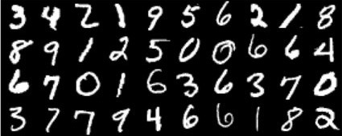

# Digit Recognition: Numerical Methods Group Project. Made by Tomás Caneda and Martín Mallol.
## 2021, 2nd semester



## Local Setup

1. Create an empty git repo and clone this project
```
git init
git remote add origin <new-git-url>
```

2. Download the pybind` and `eigen` repos as submodules
```
git submodule init
git submodule add https://github.com/eigenteam/eigen-git-mirror
git submodule add https://github.com/pybind/pybind11
git mv eigen-git-mirror eigen
# We choose the versions of eigen and pybind
cd pybind11/ && git checkout v2.2.4 && cd ..
cd eigen && git checkout 3.3.7 && cd ..
```

3. Install requirements (*Previously, activate the virtual environment in your PC. See below.*)
```
pip install -r requirements.txt
```

4. Decompress data
```
cd data && gunzip *.gz && cd ..
```

5. Run Jupyter
```
jupyter lab
```

That's it!

## Python's virtual environment creation

### With Python3 (this one worked best for me)
```
python3 -m venv your-project-name
source your-project-name/bin/activate
```

### With pyenv
```
curl https://pyenv.run | bash
```

Then, it is suggested to add some code lines into the basrch. After that, **RESTART THE SHELL** and add the following code...
```
pyenv install 3.6.5
pyenv global 3.6.5
pyenv virtualenv 3.6.5 your-project-name
```

On the project's directory:
```
pyenv activate your-project-name
```

### With Conda
```
conda create --name your-project-name python=3.6.5
conda activate your-project-name
```

## Dependencies installment
```
pip install -r requirements.txt
```

## How to run Jupyter Notebooks
### 1st way
```
cd notebooks
jupyter lab
```

### 2nd Way
```
jupyter notebook
```

## Compilation
Execute the first cell of the `knn.ipynb` notebook. If this doesn't work, folow the next steps:

- Compile C++ code on a Python module
```
mkdir build
cd build
rm -rf *
cmake -DPYTHON_EXECUTABLE="$(which python)" -DCMAKE_BUILD_TYPE=Release ..
```
- When executing the following command, the project gets compiled and the library is installed in the `notebooks` directory.
```
make install
```

## Overview
This project studies a technique used for the area of Optical Character Recogniion (OCR). The learning process of the machine is being supervised with the k-Nearest Neighbors (kNN) classifier. By doing so, we discovered that a dimensionality reduction is necessary to be implemented on the samples of the dataset we were using. That's why we made experiments with the Principal Component Analysis (PCA) method. Its theoric fundamentals are discussed briefly.

### Project's directories and files

In `data/`, as its name points out, we have the training data (`data/train.csv`) and the testing data (`data/test.csv`).

In `src/` we have the C++ code. More specifically, in `src/metnum.cpp` we finde the pybind's entry-point.

In `notebooks/` we can find some examples that can be useful for running the project using the 'sklearn' library and the C++ implementation. 

In `docs/` the different metrics on our disposal can be found. Moreover, the project's tasks and presentation reside in this directory.

`tp2` is the directory where we created the virtual environment. It can be accessed by running the following code:
```
source tp2/bin/activate
```

Finally, in Informe.pdf there's the final essay.

### Users should be able to
- Compile and run the C++ code.
- Run every Notebook in the project (experiments and testing).
- Read the essay and compare our conclusions with theirs.

### Built with
- C++
- Python
- Jupyter Notebooks
- Digit Recognizer MNIST dataset

### What I learnt
- How a classifier and a dimensionality reduction technique work.
- Get the pros and cons of throwing away 'redundant' data. Trying to find the best parameters so I cand get the best case scenario for every technique.
- Manipulate a really big and complete dataset by taking small to medium sized representative samples.
- Get the performance and time execution of multiple running tests.
- Compare different metrics.
